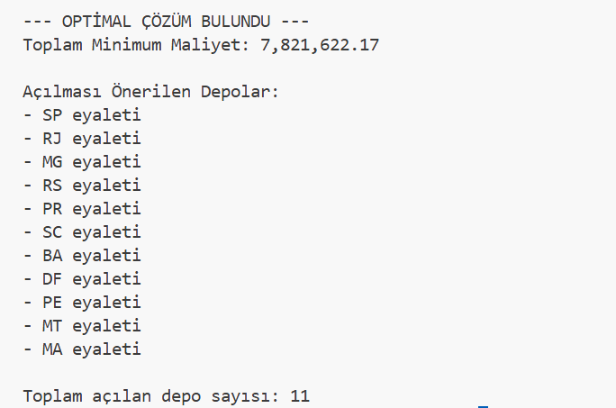
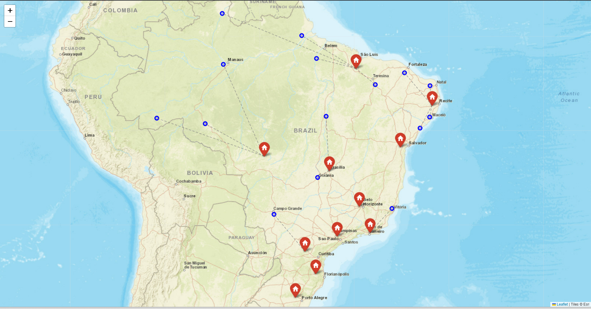
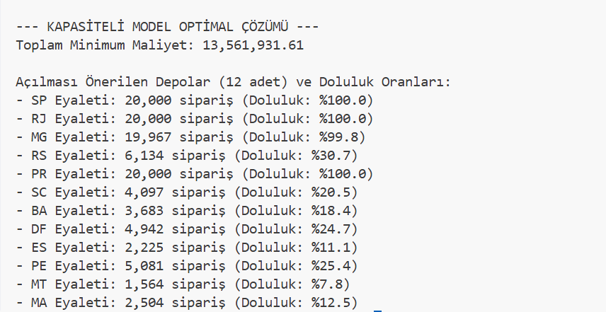
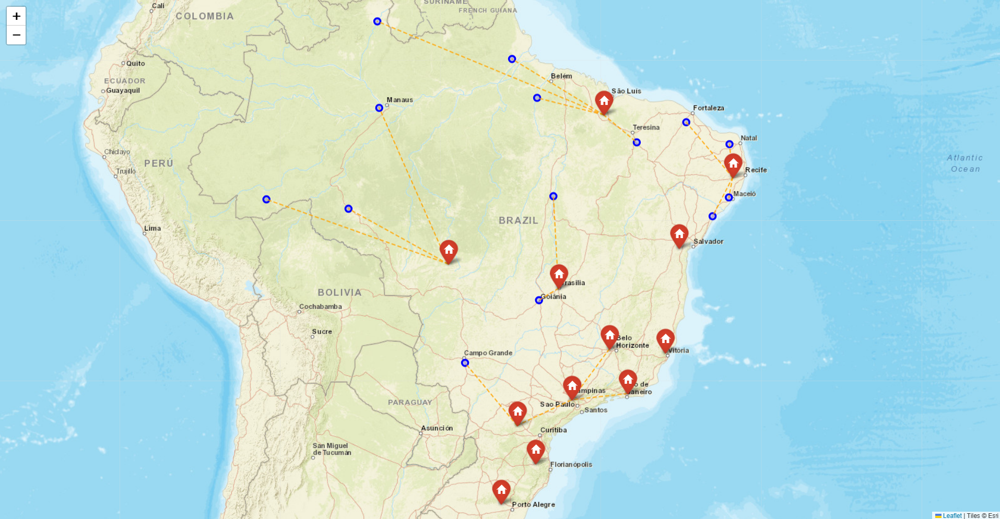
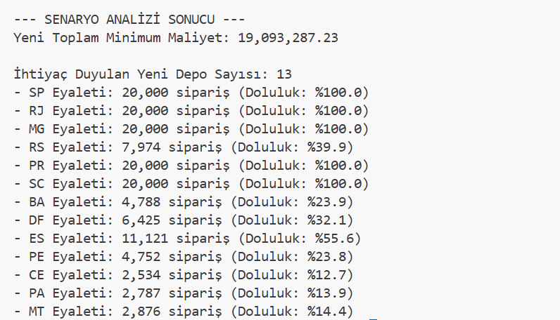
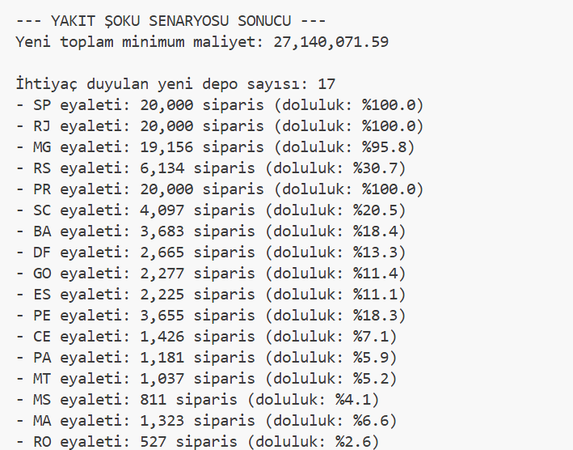

# 📦 Olist Supply Chain Network Optimization (MILP)

Bu proje, Brezilya merkezli e-ticaret platformu Olist'in gerçek veri setini kullanarak, ülkedeki lojistik ağını optimize etmeyi amaçlayan uçtan uca bir **Yöneylem Araştırması** ve **Veri Analitiği** çalışmasıdır. 

Descriptive raporlamanın ötesine geçerek, optimizasyona dayalı prescriptive stratejiler üretebilmek modern veri biliminin en kritik yetkinliğidir. Bu vizyonla geliştirilen modelimiz; tedarik zincirindeki depolama ve nakliye maliyetlerini matematiksel olarak minimize etmek amacıyla **Capacitated Facility Location** problemini Karışık Tamsayılı Doğrusal Programlama (MILP) mimarisiyle çözmektedir.


Veri rollerinde sadece "geçmişte ne olduğunu" raporlamak değil, "gelecekte ne yapmalıyız" sorusunu cevaplayabilmek kritik bir yetenektir. Bu doğrultuda modelimiz; depolama ve nakliye maliyetlerini minimize etmek için **Kapasiteli Tesis Yeri Seçimi** problemini Karışık Tamsayılı Doğrusal Programlama (MILP) ile çözmektedir.

## 🛠️ Kullanılan Teknolojiler
* **Gurobi Optimizer:** Matematiksel optimizasyon ve karar modeli çözümü (Academic License)
* **DuckDB & SQL:** Ham e-ticaret verisinin işlenmesi ve talep noktalarının belirlenmesi
* **Python (Pandas & NumPy):** Coğrafi koordinatlar üzerinden Haversine formülü ile 27x27 coğrafi mesafe matrisinin hesaplanması
* **Folium:** Çıkan optimal sonuçların ve lojistik ağın harita üzerinde interaktif görselleştirilmesi

## 🧠 Matematiksel Model ve İş Akışı

**Problem:** Brezilya devasa bir ülke. Müşterilere en hızlı ve ucuz şekilde ürün ulaştırmak için hangi eyaletlere dağıtım deposu açmalıyız ve hangi müşteriye hangi depodan ürün göndermeliyiz?

1. **Data Ingestion:** `customers`, `orders` ve `order_items` tabloları DuckDB üzerinde birleştirilerek eyalet bazlı talep hesaplanmıştır. `geolocation` verisi kullanılarak Brezilya'daki 27 eyaletin merkez koordinatları bulunmuş ve Python ile tam bir mesafe/nakliye maliyet matrisi üretilmiştir.
2. **Karar Değişkenleri:** 
   * **Depo açılış kararı ($y_j$):** $j$ eyaletinde depo açılmalı mı? (Binary)
   * **Atama kararı ($x_{ij}$):** $j$ deposundan $i$ eyaletine ne kadar ürün gönderilmeli? (Continuous)
3. **Kısıtlar:**
   * Her eyaletin talebi tam olarak karşılanmalıdır.
   * Kapalı depodan gönderim yapılamaz.
   * **Kapasite Kısıtı:** Bir depodan çıkan ürün miktarı, o deponun belirlenen maksimum kapasitesini aşamaz.
4. **Amaç Fonksiyonu:** Depo açmanın getirdiği sabit maliyet ile mesafeye bağlı nakliye maliyetlerinin toplamını minimize etmek.

---

## 📊 Optimizasyon Aşamaları ve Bulgular

### 1. Sınırsız Kapasiteli Temel Model 
İlk aşamada model, 27 aday lokasyon arasından **11 stratejik dağıtım merkezi** (SP, RJ, MG, RS, PR, SC, BA, DF, PE, MT, MA) seçmiştir. Yüksek talebe sahip sanayi eyaletlerinde yerel merkezler açılırken, uzak coğrafyalarda nakliye maliyetini engellemek adına bölgesel merkezler kurulmuştur. Toplam maliyet **7.82 Milyon** birim olarak gerçekleşmiştir.



*(Not: İnteraktif haritayı incelemek için repodaki `images/network_map.html` dosyasını tarayıcınızda açabilirsiniz.)*

### 2. Kapasiteli Tesis Yeri Seçimi
Gerçek dünya kısıtları gereği her depoya maksimum **20.000 sipariş** işleme kapasitesi sınırı getirilmiştir. 
Kapasite kısıtı eklendiğinde; Sao Paulo (SP), Rio de Janeiro (RJ) ve Parana (PR) depoları %100 doluluğa ulaşmıştır. Model, kapasite darboğazını aşmak için Espirito Santo (ES) gibi yeni lokasyonlarda mecburen depo açarak **toplam depo sayısını 12'ye** çıkarmış ve maliyet **13.56 Milyon** birime yükselmiştir.



*(Not: İnteraktif haritayı incelemek için repodaki `images/capacitated_network_map.html` dosyasını tarayıcınızda açabilirsiniz.)*

---

## 🌪️ What-If Analysis

Yöneylem araştırması modellerinin dalgalanmalara karşı dayanıklılığını test etmek için iki farklı stres testi uygulanmıştır:

### A) Talep Artışı Senaryosu (Black Friday)
Kampanya döneminde tüm ülke genelinde **taleplerin %30 arttığı** varsayılmıştır. 
Sadece SP ve RJ değil, Minas Gerais (MG) ve Santa Catarina (SC) depoları da tam kapasiteye ulaşmıştır. Dev yükü hafifletmek için Ceara (CE) ve Para (PA) eyaletlerinde yeni depolar açılmış, **depo sayısı 13'e** ve maliyet **19.09 Milyon** seviyesine fırlamıştır. Model yoğun kampanya krizini başarıyla çözmüştür.



### B) Yakıt Şoku Senaryosu (Nakliye Maliyeti Artışı)
Lojistik kriz simülasyonu olarak **birim nakliye maliyeti 3 katına** çıkarılmıştır.
Nakliye inanılmaz pahalandığı için model, uzak mesafelere sevkiyat yapmaktan kaçınmıştır. Bunun yerine sabit kurulum maliyetini gözden çıkararak Rondonia (RO), Mato Grosso do Sul (MS) ve Goias (GO) gibi **lokal depolar açmaya yönelmiş**, depo sayısını **17'ye çıkararak** kriz stratejisini tamamen değiştirmiştir.



---

## 🚀 Nasıl Çalıştırılır?

Projeyi kendi bilgisayarınızda test etmek için ana dizinde sırasıyla aşağıdaki dosyaları çalıştırabilirsiniz:

1. **Veritabanını ve mesafeleri hazırlamak için:**
   ```bash
   python prepare_model_inputs.py
